# Daret / Darna - Plateforme Immobilière & Épargne Collective

## Contexte du projet
Ce projet consiste à concevoir et livrer l'interface web d'une plateforme de publication et gestion d'annonces immobilières et d'épargne collective, appelée **Daret/Darna**, en s'adossant strictement à l'API existante. Le front-end doit être performant, accessible, responsive et intégrer le temps réel (chat et notifications).

---

## 📌 Fonctionnalités

### Annonces immobilières
- Recherche multi-critères : mots-clés, localisation + rayon, prix, surface, pièces, équipements, type de transaction.
- Affichage liste + carte (cluster, marqueurs, géolocalisation).
- Détail annonce : médias, infos générales, caractéristiques, règles, diagnostics, disponibilité, contact vendeur.
- Création/édition/suppression d'annonce via formulaires validés côté front.
- Gestion des annonces : brouillon, publiées, rejetées, promotions.
- Leads et intérêt : déclenchement lead, ouverture de thread chat.

### Comptes & abonnements
- Authentification : email + mot de passe, SSO OAuth, vérification email, 2FA (si activé par API).
- Profils : Visiteur, Particulier, Entreprise, Admin.
- Abonnements : gratuit, pro, premium, avec effets visibles (priorité d'affichage, quotas, badges).

### Médias
- Upload images/vidéos via URL présignée MinIO.
- Aperçu, barre de progression, gestion des vignettes.

### Temps réel
- Notifications in-app via WebSocket + centre de notifications (marquer comme lu, non lus).
- Chat vendeur-intéressé : présence, accusés de lecture, envoi fichiers.

### Financement
- Page banques partenaires et simulateur de crédit (front).
- Intégration Tirelire/Daret (épargne collective) : parcours découverte + redirection/interop via API.

### Daret / Darna
- Liste de groupes, création, membres, tours de contribution, calendrier/étapes.
- Suivi paiements, historique, rappels/notifications, score de fiabilité.
- Messagerie de groupe : texte + audio si exposé par API, ouverture de tickets.

### Espace Admin
- Tableau de bord avec statistiques clés.
- Modération annonces / signalements.
- Gestion plans & tarifs.
- Validation KYC entreprises + contrôle KYC particuliers.
- Paramètres système visibles si exposés par API.

---

## 📋 Parcours utilisateurs

| Rôle | Actions principales |
|------|-------------------|
| Visiteur | Recherche, consulte détail, contacte (lead), création compte si nécessaire |
| Particulier / Entreprise | Authentification, création/édition annonce, reçoit leads, chat, gère abonnements, notifications |
| Admin | Authentification, modération, validation KYC, suivi statistiques |

---

## 🖼️ Écrans à livrer

| Écran | Image |
|-------|-------|
| Accueil | `1.png` |
| Résultats de recherche + carte | `2.png` |
| Détail annonce | `3.png` |
| Auth : login, register, vérif email, 2FA, reset MDP, SSO callback | `4.png` |
| Création / édition d'annonce (multi-étapes) | `5.png` |
| Mes annonces | `6.png` |
| Leads / Inbox + Chat thread | `7.png` |
| Centre de notifications | `8.png` |
| Banque & simulateur de crédit | `9.png` |
| Daret : liste groupes, détail, création, contributions, historique, tickets | `10.png` |
| Profil & abonnement | `11.png` |
| Admin : dashboard, modération, plans, KYC, stats | `12.png` |

---

## ⚙️ Technologies suggérées
- **Frontend** : React ou Next.js, TypeScript, Tailwind CSS.
- **Gestion temps réel** : WebSocket ou Socket.io.
- **Upload médias** : MinIO / API présignée.
- **Notifications** : WebSocket / API.
- **Gestion des états** : Redux ou Zustand.
- **Tests UI** : Jest + Testing Library.

---

## 🚀 Lancement du projet

```bash
# Cloner le dépôt
git clone <repo-url>
cd daretdarna-frontend

# Installer les dépendances
npm install

# Lancer en mode développement
npm run dev

# Build production
npm run build
npm run start
```

### Admin :

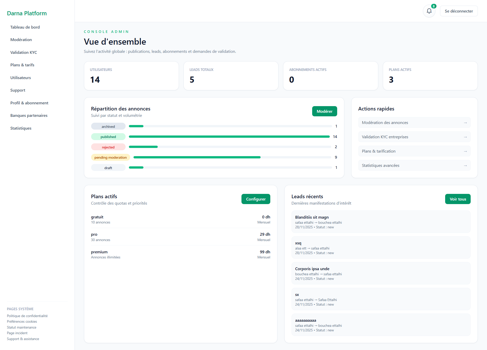
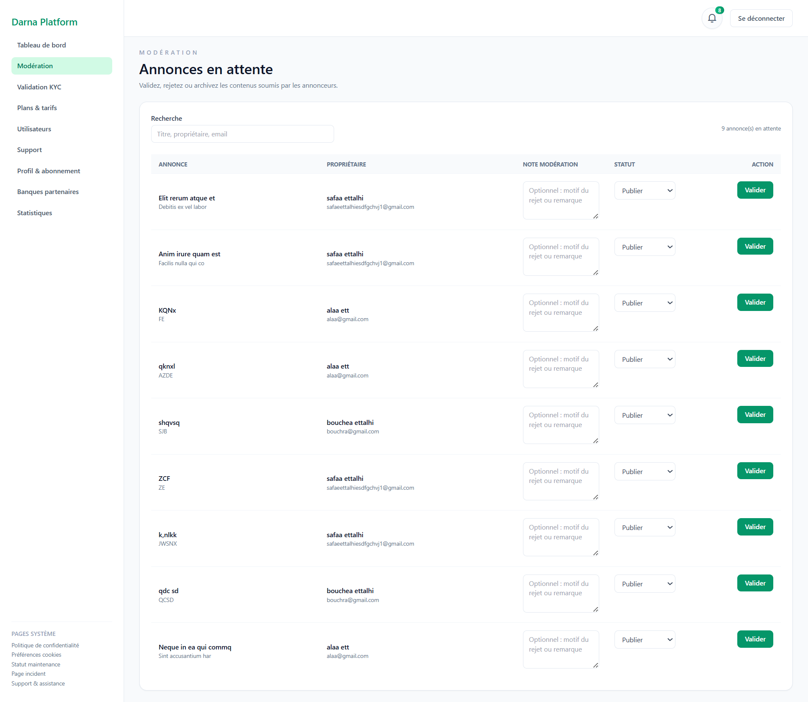
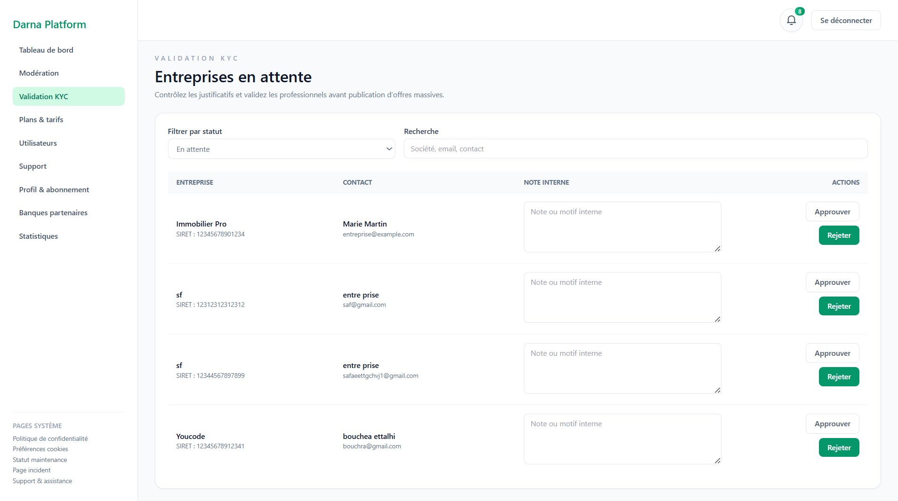
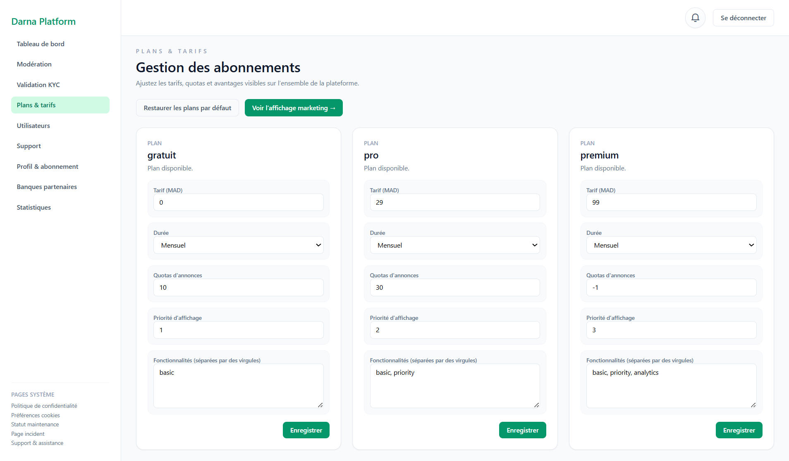
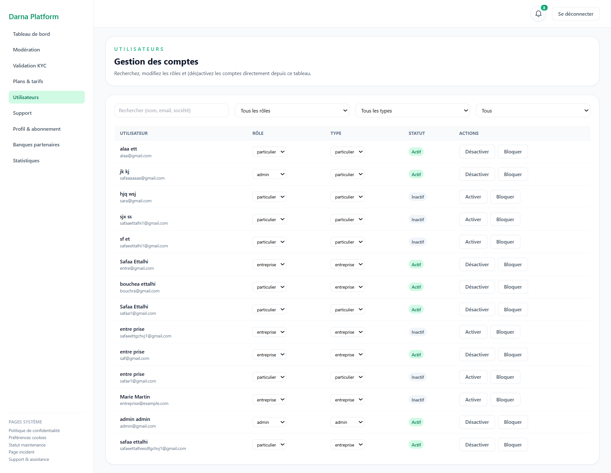
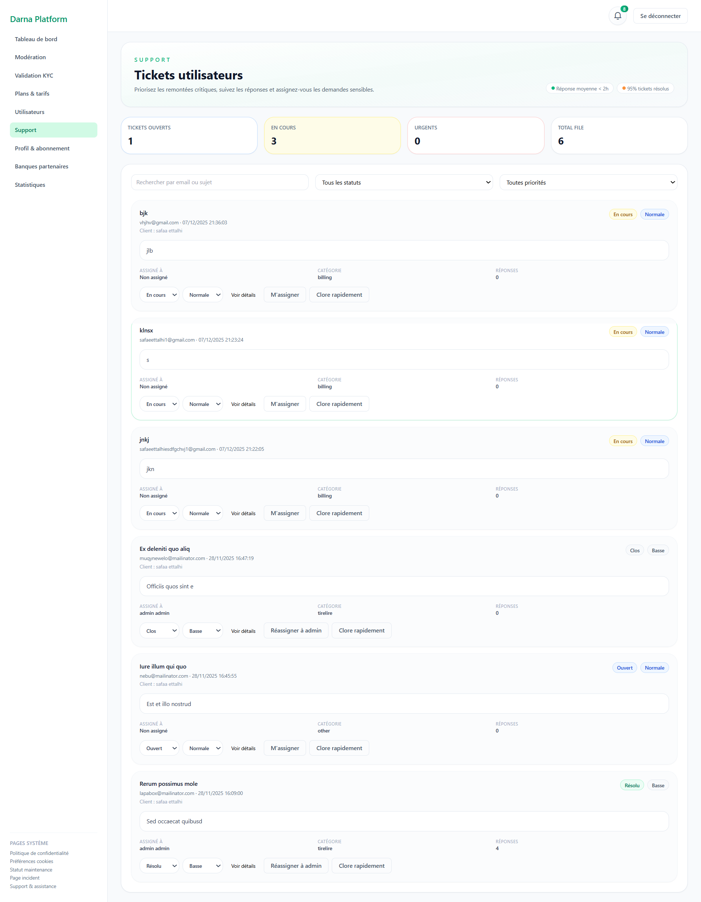
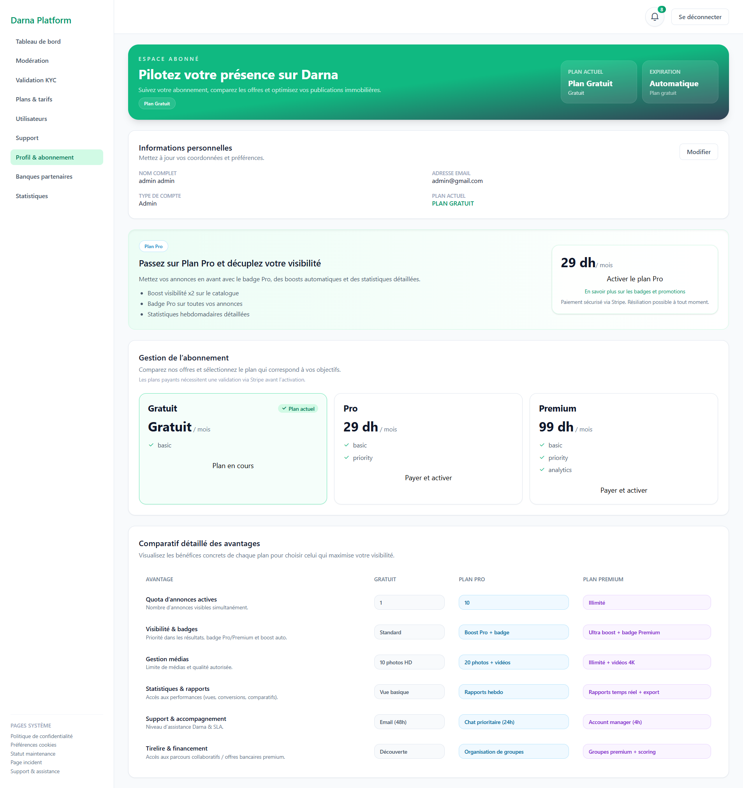
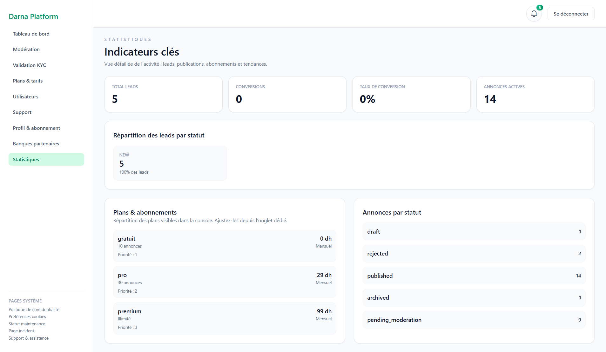

### Particulier / Entreprise

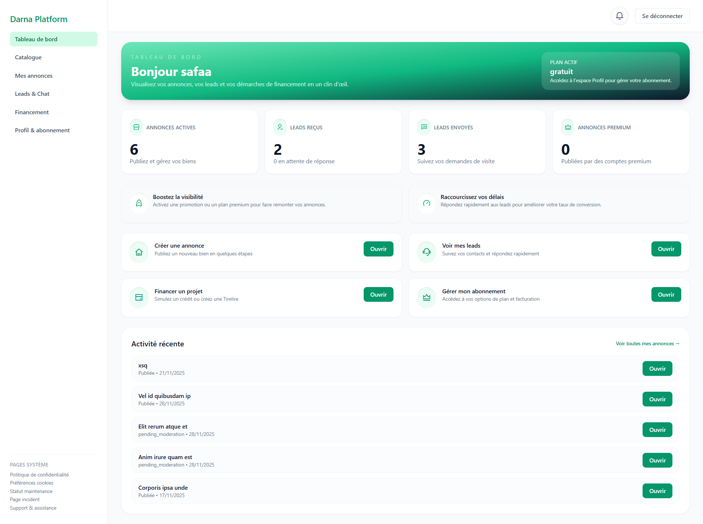
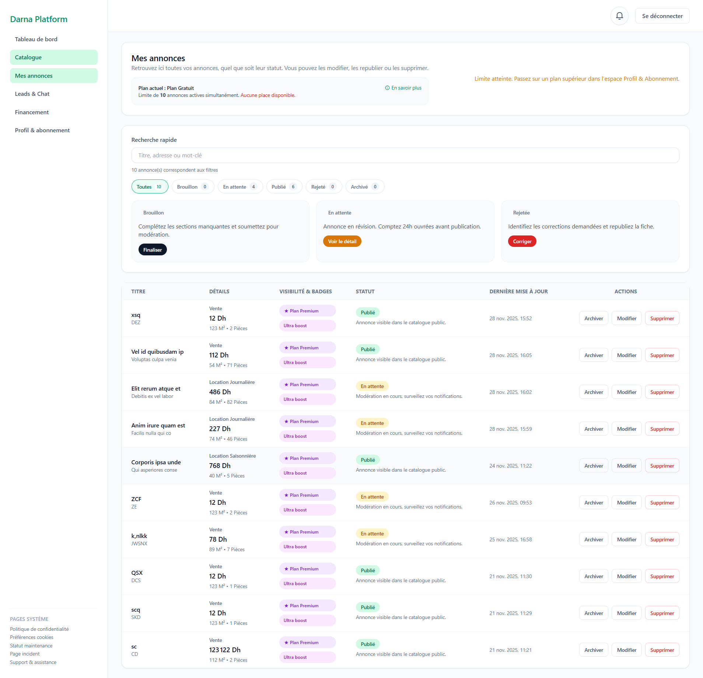
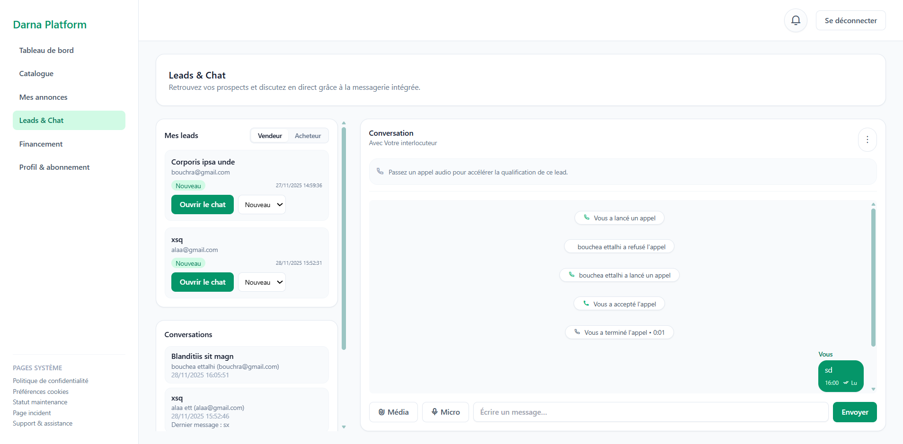
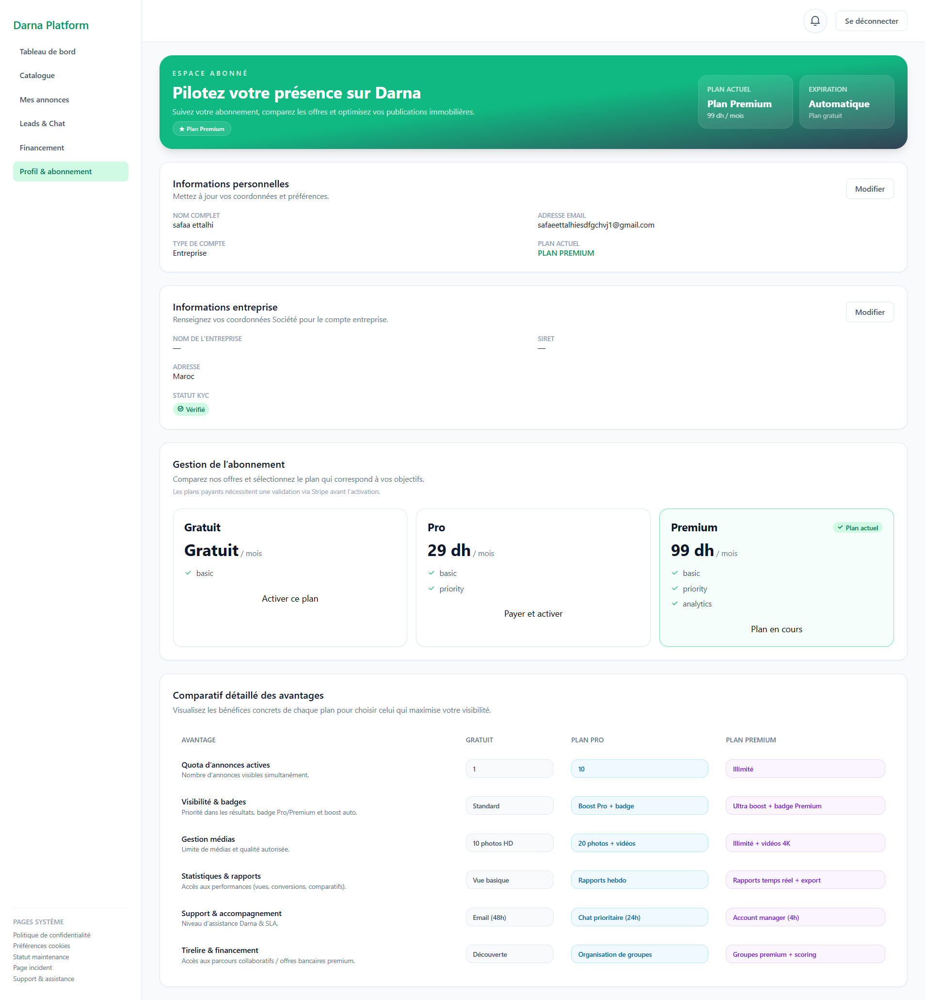

